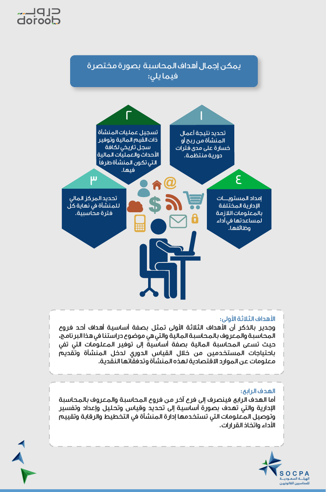
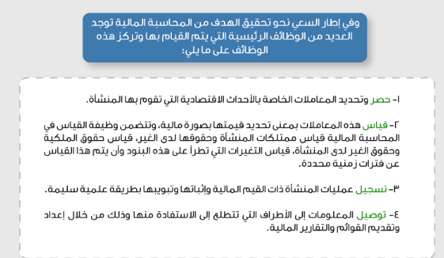

## الهدف الأساسي للمحاسبة:
في ضوء التعريف السابق للمحاسبة يمكن القول أن الهدف الأساسي للمحاسبة هو توفير المعلومات المحاسبية التي تفي باحتياجات الأطراف المتعددة التي تتطلع إلى الاستفادة من هذه المعلومات سواء كانت أطرافاً داخلية ممثلة في الإدارة بمستوياتها المختلفة، أو كانت أطرافاً خارجية ممثلة في المستثمرين والدائنين والعملاء والجهات الحكومية.
----
أهداف الماحاسبة المالية:

## هدف المحاسبة لدى المعايير الدولية للتقرير المالي - IFRS:
هدف التقارير المالية هو المساعدة في اتخاذ قرارات الاستثمار والإقراض.
---
## الوظائف الرئيسية للمحاسبة المالية:

# فروع المحاسبة:
### 1. المحاسبة المالية :
    هي أحد فروع المحاسبة الذي يختص بتوثيق/تسجيل ومعالجة البيانات المالية وتلخيصها وإيصالها للمستفيدين منها في شكل تقارير مالية تعد وفقا لمعايير متفق عليها لاستخدجامها في اتخاذ القرارات.
### 2. المحاسبة الحكومية

### 3. محاسبة التكاليف
... انظر اسس المحاسبة ص - 6
### 4. المحاسبة الإدارية

### 5. محاسبة الزكاة والظرائب

